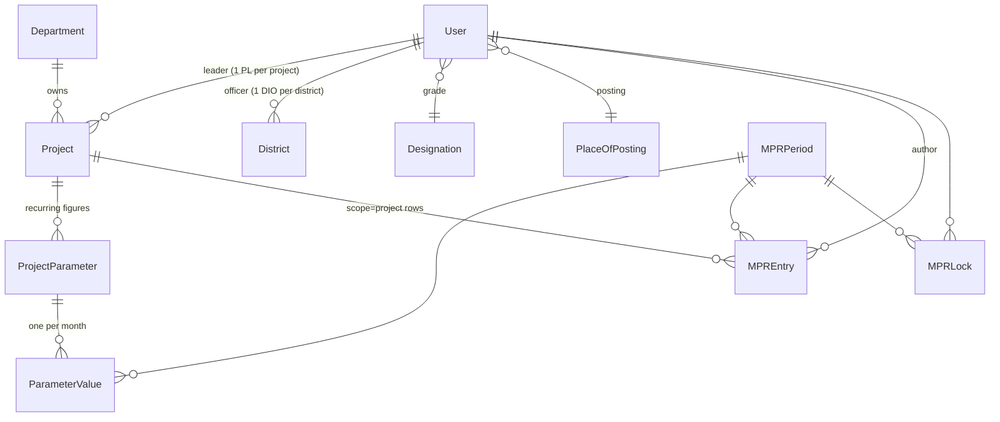

# MPR Portal — Technical Guide

Monthly Project Report portal for **NIC Rajasthan**. NIC officers sign in, fill their
part of the month's report, lock it; admins and the SIO office compile and export it.

This document explains *how it is built* — the mechanisms, the data structures, and the
algorithms behind each function. `plan.md` covers the product requirements, `design.md`
covers the visual system. This one covers the machine.

---

## 1. Stack and shape

| Layer | Choice | Notes |
|---|---|---|
| Framework | Django 6.0 | Server-rendered templates, no SPA, no REST layer |
| Database | PostgreSQL (via `psycopg3`) | Config from `.env` through `django-environ` (`env.db()` parses `DATABASE_URL`) |
| Templates | Django Template Language | Two roots: `base.html` (document) → `app.html` (signed-in shell) |
| Client JS | ~90 lines, vanilla | No build step, no framework, no bundler |
| Exports | openpyxl / python-docx / WeasyPrint / stdlib `csv` | Imported lazily inside their writer functions |
| Captcha | Pillow | Drawn in-process; no external service (NIC network is internal) |
| Package manager | `uv` (`pyproject.toml` + `uv.lock`) | Python ≥ 3.12 |

Rough size: **~1.6k lines** of application Python, **~925 lines** of tests, ~1.3k lines of
templates, 90 lines of JS. Everything lives in a **single Django app**, `accounts`.

```
mpr_raj/
├── mpr_raj/            # settings, root urlconf, wsgi/asgi
└── accounts/           # the entire application
    ├── models.py       # 10 models
    ├── forms.py        # form factories + validation
    ├── views/          # split by screen group: home, master, monthly, reporting
    ├── exports.py      # one serializer + four writers
    ├── captcha.py      # image challenge
    ├── middleware.py   # forced password change
    ├── admin.py        # Django admin config
    ├── templates/      # 27 templates
    ├── static/         # app.css, app.js, boot.js, login.js, self-hosted fonts
    └── management/commands/seed_districts.py
```

**Why one app.** Every model is in the same aggregate — a period, an entry, a lock, a
project all belong to one workflow. Splitting into `auth` / `mpr` / `reports` apps would
buy circular imports and nothing else.

**The views package is split, the app is not.** `views/__init__.py` re-exports everything,
so `urls.py` keeps addressing `views.<name>` and the split is invisible to the URL layer:

```python
from .monthly import mpr_entry_delete, mpr_entry_form, mpr_list, mpr_lock, ...
```

---

## 2. Request lifecycle

```
request
  → SecurityMiddleware, Session, Common, CSRF, Authentication, Messages, XFrameOptions
  → accounts.middleware.ForcePasswordChangeMiddleware   ← custom, last in the chain
  → urls.py → view function
      → decorator gate (@login_required / @admin_required / @monitor_required)
      → in-view ownership check (get_object_or_404 with an owner filter, or _my_reports)
      → ORM
      → render(template, ctx)   |   HttpResponse(bytes)  for exports
```

`ForcePasswordChangeMiddleware` is a **global interceptor** and deliberately sits last, so
it runs with `request.user` already resolved:

```python
if request.user.is_authenticated and request.user.must_change_password \
   and request.path not in (reverse("password_change"), reverse("logout")):
    return redirect("password_change")
```

Two paths are exempt, which is the minimum needed to avoid a redirect loop (you must be
able to reach the change form, and to give up and leave). Doing this in middleware rather
than per-view means a new view cannot forget it.

---

## 3. Data model

10 models, all in `accounts/models.py`.



### 3.1 User — role flags, not role rows

`User` extends `AbstractUser`. Roles are **four independent booleans**, not a role table
and not Django groups:

```python
is_staff (Admin) · is_sio · is_pl · is_dio
```

Roles are additive — a user can be PL *and* DIO and files both report sets. A `Role` model
plus an M2M would add a join to every permission check to express exactly the same four
bits. `roles_display` joins the set names for display.

**Username derivation** happens in `save()`: `username = email.split("@")[0]`, so the login
ID is the email prefix and is unique by the inherited unique constraint on `username`.
`UserForm.clean_email` pre-checks the derived prefix for collisions so the user gets a
form error naming the clash instead of an `IntegrityError`.

### 3.2 MPREntry — one table, seven sections

The seven narrative sections (events, reviews, training, awards, significant activities,
new activities, enhancements) share ~85 % of their columns. They live in **one table** with
a `kind` discriminator, and a **dispatch table** declares which columns each kind uses:

```python
FIELDS = {
    EVENT:    ["event_category", "date", "description", "remarks"],
    TRAINING: ["title", "date", "to_date", "participants", "target_user", "remarks"],
    ...
}
LABELS = {TRAINING: {"title": "Topic", "date": "From date", ...}}   # per-section renames
```

This is **single-table inheritance with a metadata-driven projection**. Every column is
nullable/blank at the DB level because they differ per section; correctness is enforced at
the projection layer instead. Four independent consumers read the same map:

| Consumer | Uses `FIELDS` to… |
|---|---|
| `forms.entry_form_class(kind)` | build the form for that section |
| `admin.MPREntryAdmin.get_fields` | show only that section's columns in Django admin |
| `models.MPREntry.cells()` | render a row on screen |
| `exports.tables()` | pick columns and headers for every output format |

**Consequence:** adding an eighth section is *one dict entry* — a form, an admin screen, a
row renderer, an on-screen report and four export formats all appear from it. There is no
place left where a section can be half-added.

Three shared primitives make that possible:

```python
label(kind, name)  # LABELS override, else the field's own verbose_name (capfirst)
value(name)        # get_FOO_display() if it's a choice field, else the raw attribute
cells()            # (label, value) pairs, skipping empties and the headline field
```

`cells()` is the generic row renderer: it drops fields already shown as the headline or as
a thumbnail, drops empty values, and yields label/value pairs. One template loop then
renders all seven sections.

### 3.3 Scope: which report a row belongs to

Each entry carries `scope ∈ {district, project}` plus, for project rows, a `project` FK.
`project` is **set from the report the row was filed in, never chosen in a dropdown** —
which is exactly why it is *not* in `FIELDS`. A field the user cannot get wrong is a class
of bug that cannot happen.

### 3.4 Delete semantics are deliberate per relationship

| FK | `on_delete` | Rationale |
|---|---|---|
| `MPREntry.period`, `MPREntry.author` | `PROTECT` | Filed data must not vanish with a period or a user by accident |
| `ParameterValue.period` / `.parameter`, `ProjectParameter.project` | `PROTECT` | Same — figures are the record |
| `Project.leader`, `District.officer`, `User.designation`, `User.place_of_posting` | `SET_NULL` | Deleting a *lookup* leaves the object unassigned, not deleted |
| `MPRLock.period` / `.user` | `CASCADE` | A lock is state, not data — it means nothing without its owner |
| `MPREntry.project` | `SET_NULL` | A deleted project shouldn't erase what was reported under it |

Where a delete is genuinely destructive, the confirm page **counts the damage first** —
see §7.3.

### 3.5 The lock as row-existence

`MPRLock` has no `is_locked` column. **The row existing is the lock.**

```python
def _lock(user, period):
    return MPRLock.objects.filter(period=period, user=user).first()
```

Locking = `INSERT`. Admin approving an unlock = `DELETE`. There is no state field to get
out of sync with reality, and no "locked but flagged unlocked" case to reason about. The
unique constraint `(period, user)` makes double-locking a database error rather than a
race the application has to think about. Unlock *requests* are two extra columns on the
same row (`unlock_requested`, `unlock_reason`), so a request cannot outlive its lock.

---

## 4. Authentication

### 4.1 Image captcha — algorithm

`accounts/captcha.py`. Zero external services (Recaptcha/hCaptcha are unreachable on an
internal NIC network).

**Generation** (`GET /captcha.png`):

1. Draw 5 characters from a **confusion-free alphabet** — `A–Z` and `2–9` minus `0 O 1 I`.
2. Push the code onto a **bounded rolling window of the last 3 codes** stored in the session.
3. Render 160×55 PNG with Pillow: per-character random x-jitter (±4 px) and y-offset (0–10 px),
   per-character navy-to-slate fill, then 5 random noise lines, then a `SMOOTH` filter pass.
4. Serve with `Cache-Control: no-store`.

**Why a window of 3 and not a single code.** A browser can fetch the image more than once
per page view — prefetch, back-navigation revalidation, a double render. With a single
stored code, the code the user is *looking at* would already have been overwritten by a
later fetch and every login would fail. Keeping the last 3 makes the visible code valid
regardless of how many times the browser re-requested the endpoint.

```python
codes = request.session.get(SESSION_KEY) or []
request.session[SESSION_KEY] = (codes if isinstance(codes, list) else [codes])[-2:] + [code]
```

**Verification** is *pop-then-compare*, so the whole window is consumed on any attempt —
success or failure. One challenge, one try; a wrong answer cannot be brute-forced against
a still-live code.

```python
expected = request.session.pop(SESSION_KEY, None) or []
return answer.strip().upper() in expected
```

**Ordering matters in the form.** `CaptchaAuthenticationForm.clean()` short-circuits before
`super().clean()` if any field error exists, so `authenticate()` is never called when the
captcha failed. That prevents a broken captcha from still leaking credential-validity
information through timing or error text.

### 4.2 First-login activation

A three-state account lifecycle encoded in two booleans:

| State | `must_change_password` | `is_activated` |
|---|---|---|
| Created by admin with a temp password | `True` | `False` |
| Signed in, password not yet replaced | `True` | `False` (middleware pins them to the change form) |
| Activated | `False` | `True` |

`ForcedPasswordChangeView` swaps the form class based on that flag — `SetPasswordForm`
(no "old password" field) on first login, the standard `PasswordChangeForm` afterwards —
and flips both booleans in `form_valid`. Activation is therefore a **side effect of the
first successful password set**, not a separate admin action that could be forgotten.

---

## 5. Authorization — three layers

There is no permission framework here. Access control is three concentric checks, each
doing exactly one job.

**Layer 1 — role gates (decorators).** Coarse, at the view boundary:

```python
admin_required   = user_passes_test(lambda u: u.is_staff)
monitor_required = user_passes_test(lambda u: u.is_authenticated and (u.is_staff or u.is_sio))
```

The `is_authenticated` check is first in `monitor_required` on purpose: `AnonymousUser`
carries `is_staff` but not the custom role flags, so `u.is_sio` would raise.

**Layer 2 — ownership folded into the fetch.** Not "fetch then check" — the owner is part
of the lookup, so a non-owner gets a 404 and learns nothing about whether the object exists:

```python
get_object_or_404(Project, pk=project_pk, leader=request.user)
get_object_or_404(MPREntry, pk=pk, author=request.user, period=period)
```

**Layer 3 — the capability list.** For "which reports may this person file into", the
system builds the allowed set and tests membership, rather than writing a predicate:

```python
def _my_reports(user):
    reports = [(MPREntry.DISTRICT, None)] if user.is_dio else []
    if user.is_pl:
        reports += [(MPREntry.PROJECT, p) for p in user.projects.all()]
    return reports
```

Every write path checks `(scope, project) in _my_reports(user)`. This is a **whitelist, not
a validation rule** — the failure mode of a whitelist is "denied", the failure mode of a
predicate is "allowed by an unconsidered case". `_my_reports` is the single place that
answers what a user owes; the dashboard, the month page, the report page, the entry form
and the post-save redirect all derive from it.

*(Subtlety: membership uses tuple equality, which falls through to Django's model `__eq__`
— same concrete class and same PK. It compares identity, not object instance.)*

**The editability predicate** is one function every editing view calls:

```python
def _editable(user, period):
    return period.is_open and not _lock(user, period)
```

Two conditions, one place. A new editing view means calling `_editable`, not re-deriving
"open AND unlocked" and getting one half of it wrong.

---

## 6. Filling a month — `views/monthly.py`

### 6.1 The decomposition problem

A month is not one long form. It is **one report per thing the user owns**: one district
report plus one per project led. The reason is data-structural, not cosmetic — a single
merged set of sections cannot say which project an event or a training belonged to.

`_group(user, period, entries, scope, project)` assembles one report view-model. The
notable part is that it **partitions in memory**, not in the database:

```python
entries = list(period.entries.filter(author=request.user).select_related("project"))
groups  = [_group(user, period, entries, s, p) for s, p in _my_reports(user)]
```

One query fetches the user's entries for the month; each group filters that list by
`(scope, project_id)` and buckets by `kind`. For a user with *R* reports and *K* sections
this is **O(R·K·N) in Python over a set of at most a few dozen rows**, against
**O(R·K) queries** if each section filtered independently. At this cardinality the
in-memory scan is free and the query count is the thing worth minimising.

### 6.2 Adaptive navigation

`mpr_month` computes `split = len(groups) > 1`:

- **One report owed** → the month page *is* that report; sections render inline, no chooser.
- **Several** → the month page is a short picker listing each report with its entry count.

The same `_mpr_sections.html` partial renders the sections in both cases, so the two paths
cannot drift apart. `_back(user, period, project)` mirrors the decision for redirects after
save/delete — it returns to the month page when there is only one report, and to the
specific report page otherwise.

### 6.3 Dynamic form construction

Forms are **built per section at request time** by a factory, not declared seven times:

```python
def entry_form_class(kind):
    form_class = forms.modelform_factory(
        MPREntry, fields=MPREntry.FIELDS[kind], labels=MPREntry.LABELS.get(kind, {}),
        widgets={"date": DateInput(type="date"), "description": Textarea(rows=3), ...})
    headline = "title" if "title" in form_class.base_fields else "description"
    form_class.base_fields[headline].required = True    # blank rows can't sail through
    return form_class
```

Because every model column is optional (they differ per section), the factory re-imposes
**one** requirement: the field that identifies the row — `title` when the section has one,
otherwise `description`. That is the minimum needed to stop empty rows, chosen at runtime
from the section's own field list.

### 6.4 Assigning scope safely on a new row

For a new entry, the query string says which report it belongs to. The resolution is
written to fail closed:

```python
reports = _my_reports(request.user)
only    = reports[0] if len(reports) == 1 else (None, None)
wanted  = request.GET.get("project")
entry.scope   = request.GET.get("scope") or only[0]
entry.project = (next((p for _, p in reports if p and str(p.pk) == wanted), None)
                 if wanted else only[1])
if (entry.scope, entry.project) not in reports or kind not in dict(_kinds(entry.scope)):
    raise Http404("That section isn't part of this report")
```

Three things happen here: a user who owes exactly one report never has to answer the
question; a named project is matched **against the user's own list** rather than fetched by
PK; and an unmatched name resolves to `None` and then fails the membership check — it does
**not** silently fall back to the user's first project, which would file the row somewhere
they never asked for. The `_kinds(scope)` check additionally blocks PL-only sections
(`enhancement`) from a district report.

### 6.5 Parameter carry-forward

Each project reports recurring figures (`ProjectParameter`) with three columns per month:
previous / reporting / cumulative. Opening the figures page runs a **lazy materialise with
carry-forward**:

1. Find the previous period by ordering, not by date arithmetic:
   ```python
   MPRPeriod.objects.filter(Q(year__lt=y) | Q(year=y, month__lt=m)).first()
   ```
   The model's `ordering = ["-year", "-month"]` makes `.first()` the immediately preceding
   month. This is a lexicographic `(year, month)` comparison — correct across a year
   boundary and correct when months are skipped, which a `month - 1` would not be.
2. Build `{parameter_id: reporting_month}` from that period in one `values_list` query.
3. `get_or_create` a `ParameterValue` per parameter, seeding `previous_month` from the map.

So last month's *reporting* figure becomes this month's *previous* figure automatically,
and rows exist only once someone actually opens the page. Editing uses a
`modelformset_factory` over the resulting queryset.

**Read-only enforcement is structural.** For a closed or locked month, every field is
marked `disabled` — and Django's `disabled=True` makes the form ignore POSTed data for that
field entirely, falling back to the initial value. A hand-crafted POST against a locked
month is a no-op without a separate check. (The view also refuses to save; the disabled
flag means it would be harmless even if it didn't.)

### 6.6 Lock flow

```
editable ──[GET /lock/]──> confirm page (states the cost)
         ──[POST /lock/]─> MPRLock row created ──> read-only
read-only ─[POST /unlock-request/]─> unlock_requested=True + reason
         ──[admin POST /reports/unlock/<pk>/]──> lock row DELETEd ──> editable
```

GET states what locking costs, POST performs it — a server-rendered confirm page rather
than a JS `confirm()` dialog, so it cannot be dismissed by a stray Enter key or bypassed
with JS off.

---

## 7. Master data — `views/master.py`

### 7.1 The shared confirm-delete

One helper serves every destructive path:

```python
def _confirm_delete(request, obj, back, label, warnings=()):
    if request.method == "POST":
        obj.delete()
        return redirect(back)
    return render(..., {"obj_label": label, "back_url": resolve_url(back), "warnings": warnings})
```

`resolve_url` accepts either a URL name or an already-built path, so callers that need
arguments (`reverse("project_edit", args=[...])`) use the same helper as those that don't.

### 7.2 Consequences are counted, not guessed

Each caller computes what the delete will actually take with it, from the database, before
showing the page:

- **User** → counts their filed entries, and names the projects/districts that will be left
  unassigned.
- **Project / District** → names the assigned officer who will be unassigned.
- **ProjectParameter** → counts how many months of figures go with it: *"Figures filed for
  7 months go with it — past reports and exports will change."*

That last one is the only genuinely silent-damage path in the system (removing a parameter
rewrites the history of every past export), so it is the loudest warning.

**Self-deletion is blocked at the view**, not just hidden in the template — an admin
deleting their own account would log themselves out mid-request.

### 7.3 Two forms on one page

The project edit page hosts both the project form and the "add parameter" form. They are
disambiguated by **submit-button name**, so only the submitted form is ever bound:

```python
adding = "add_parameter" in request.POST
form       = ProjectForm(None if adding else request.POST or None, instance=project)
param_form = ProjectParameterForm(request.POST if adding else None, project=project)
```

An unbound form shows no validation errors, so adding a parameter never lights up the
project form in red.

### 7.4 Parameter ordering and uniqueness

- **Append semantics:** `order = max(existing order) + 1` in `save()`, so new parameters
  land at the bottom of the table.
- **Case-insensitive uniqueness** is validated in `clean_name` with `name__iexact`. The DB
  has a `UniqueConstraint(project, name)`, but Django *skips* `unique_together`-style
  validation when a member field (`project`) isn't on the form — and the constraint would
  not catch "Challans issued" vs "challans Issued" anyway. Both layers are needed and both
  are present.

### 7.5 Bi-directional assignment

`Project.leader` / `District.officer` are FKs, which structurally guarantees *one* leader
per project. But assignment is possible from both ends: the project form picks a leader,
and the user form has checkbox lists of projects and districts. The user form writes the
other side through the reverse manager:

```python
user.projects.set(self.cleaned_data["projects"])     # points each Project.leader at this user
user.districts.set(self.cleaned_data["districts"])
```

Assigning a project to a new leader therefore *steals* it from the previous one — which is
the correct behaviour for a single-owner FK, and is what the form's help text says.

---

## 8. Monitoring and compilation — `views/reporting.py`

### 8.1 Period selection

Every reporting screen is "one month at a time", chosen by `?period=<pk>` so the URL is
linkable and shareable, defaulting to the newest period:

```python
period = next((p for p in periods if str(p.pk) == request.GET.get("period")),
              periods[0] if periods else None)
```

A `next()` over the already-fetched list rather than a second query, and an unparseable or
foreign `?period=` degrades to the default instead of erroring.

### 8.2 Filing status — sparse pivot into a dense grid

`report_status` produces a matrix: one row per PL/DIO, one column per section, plus figure
counts and lock state. The naive version is a query per user per section — *U × K* queries.

The implementation is **three aggregate queries, then an O(U·K) dictionary densification**:

```python
counts  = {(r["author"], r["kind"]): r["n"] for r in MPREntry.objects
           .filter(period=period).values("author", "kind").annotate(n=Count("id"))}
figures = dict(ParameterValue.objects.filter(period=period).exclude(reporting_month="")
               .values_list("parameter__project__leader").annotate(n=Count("id")))
locks   = {l.user_id: l for l in MPRLock.objects.filter(period=period).select_related("user")}

rows = [{"user": u,
         "counts": [counts.get((u.id, k), 0) for k, _ in kinds],
         "total":  sum(n for (author, _), n in counts.items() if author == u.id),
         "figures": figures.get(u.id, 0),
         "lock":    locks.get(u.id)} for u in reporters]
```

The database returns only the **sparse** cells (a `GROUP BY author, kind` — nothing for
combinations nobody filed); Python fills the zeros. Total queries: **4, independent of the
number of users or sections.**

The figures aggregate is worth noting: it counts a parameter as *entered* only when the
reporting-month column is non-empty (`.exclude(reporting_month="")`), because rows are
materialised by `get_or_create` the moment someone merely *opens* the figures page —
existence is not evidence of entry.

### 8.3 Column-width algorithm

Each table row is its own CSS grid, so the track list must be **deterministic** — identical
for the header row and every data row. The view computes it from the data:

```python
px_per_char, cell_padding = 7.4, 14
widths = [round(min(max([len(h)] + [len(r[i]) for r in rows]), 34) * px_per_char) + cell_padding
          for i, h in enumerate(headers)]
return f"{fixed} minmax({widths[-1]}px, 1fr)", f"{sum(widths)}px"
```

Longest cell per column → clamped at 34 characters → multiplied by an average glyph width →
plus padding. The last column gets `minmax(Npx, 1fr)` so the table still fills the
container; everything before it is fixed pixels.

**Why fixed pixels and not `auto` / `max-content` / `ch`:** with one grid per row, `auto`
and `max-content` resolve *per row* — every row picks its own widths and the columns
zig-zag. `ch` resolves against each element's own font size, and the header is 12 px while
rows are 14 px — so it drifts too. Fixed px is the only unit that resolves identically
across independent grids. The same clamp logic appears in the xlsx writer
(`min(max(longest + 2, 12), 50)` in Excel character units), so screen and spreadsheet agree
on what "wide" means.

The status grid derives its track list from the section count rather than hard-coding
`repeat(7, …)` — so adding a section stays "one dict entry" all the way to the CSS.

---

## 9. Export pipeline — `exports.py`

The central design decision: **gather once, format four ways.**

```
tables(period, only=None)  ──►  [{key, title, headers, rows}]   rows = list[list[str]]
                                        │
        ┌───────────────┬───────────────┼───────────────┬───────────────┐
     _csv            _xlsx           _docx            _pdf        report_table.html
   (stdlib)        (openpyxl)     (python-docx)   (WeasyPrint)      (on screen)
```

`tables()` is the **only** function that touches the ORM. The four writers receive plain
strings and do nothing but format. Two properties follow:

1. **A report and its download cannot drift apart** — `report_table.html` renders the exact
   same block the writers serialise. The template never learns what a training or an award
   is; it renders `headers` and `rows`.
2. **A new format is one function plus one `WRITERS` entry.** A new section is still one
   dict entry in `MPREntry.FIELDS`, and it appears in all five outputs.

Normalisation is a single function — dates to `dd-mm-yyyy`, `None`/`""` to `""`,
everything else `str()`:

```python
def _text(value): ...
```

`only=<key>` narrows the result to one category, which is how per-report downloads
(`?only=training`) reuse the whole-month path with no second code path.

**Query shape:** one `select_related("author", "project")` fetch for all entries and one
`select_related(...)`-with-`order_by` fetch for parameter values. Fully flat — no N+1 across
seven sections.

**Empty sections still emit their block** (with a "No entries." marker in the file formats),
so the shape of the export is identical every month regardless of what was filed.

### Per-format notes

| Format | Mechanism | Detail that matters |
|---|---|---|
| **CSV** | stdlib `csv` | Blocks stacked in one file (CSV has no sheets). Encoded `utf-8-sig` — without the BOM, Excel on Windows mangles ₹ and Devanagari |
| **XLSX** | openpyxl | One sheet per block. Sheet names sanitised: `re.sub(r"[\[\]:*?/\\]", "-", title)[:31]` — Excel's own limits. Bold header, `freeze_panes="A2"`, computed column widths |
| **DOCX** | python-docx | Heading + `Table Grid` per block |
| **PDF** | `export.html` → WeasyPrint | A4 landscape, page numbers via CSS `@page`, logo embedded as a `file://` URI resolved through `staticfiles.finders` |

All four libraries are **imported inside their writer**, so a missing or broken optional
dependency only affects the format that needs it — the app still boots and the other three
downloads still work.

### The WeasyPrint / dyld workaround

WeasyPrint `dlopen()`s Pango/Cairo **by leaf name**, and macOS's dyld does not search
Homebrew's prefix. `_dyld_fallback()` patches `DYLD_FALLBACK_LIBRARY_PATH` in-process
*before* the import, preserving dyld's built-in default chain when the variable is unset:

```python
default = f"{os.path.expanduser('~')}/lib:/usr/local/lib:/lib:/usr/lib"
paths = (os.environ.get("DYLD_FALLBACK_LIBRARY_PATH") or default).split(":")
```

It appends the two Homebrew prefixes and no-ops on non-Darwin. This removes the dependency
on *how* the server was launched. If the libraries genuinely aren't installed, the view
catches `OSError` and returns a **503 naming the missing libraries** instead of a blank 500:

```python
except OSError as exc:
    return HttpResponse(f"PDF export needs the WeasyPrint system libraries ... {exc}",
                        status=503, content_type="text/plain")
```

---

## 10. Frontend

No framework, no build step. ~90 lines of JS across three files.

### 10.1 Render-blocking boot script

`boot.js` is loaded **without `defer` or `async`** — the one script in the project that is:

```js
if (localStorage.getItem("sb") === "1") document.documentElement.classList.add("sb-collapsed");
document.documentElement.dataset.theme = localStorage.getItem("theme")
  || (matchMedia("(prefers-color-scheme: dark)").matches ? "dark" : "light");
```

It must apply the saved sidebar width and theme **before first paint**, or every navigation
flashes the wrong sidebar width and a white page (the classic FOUC / dark-mode flash). It
is kept to two lines precisely because it blocks rendering. Everything else (`app.js`) is
deferred.

### 10.2 Progressive enhancement, native-first

Interaction uses platform elements before JavaScript:

| Need | Mechanism |
|---|---|
| Section accordions, account menu | `<details>/<summary>` |
| Date entry | `<input type="date">` — native picker, no library |
| Destructive confirm | Server-rendered confirm page (locks, deletes) |

JS only handles what has no native equivalent: closing `<details>` menus on outside-click
and Escape, the theme/sidebar toggles, and the period picker's submit-on-change (which has
a `<noscript>` fallback button).

Confirmation dialogs use **one delegated listener** rather than an `onsubmit` per form —
a template opts in by adding an attribute:

```js
document.addEventListener("submit", function (e) {
  var q = e.target.dataset.confirm;
  if (q && !confirm(q)) e.preventDefault();
});
```

### 10.3 Template hierarchy

```
base.html          document shell: <head>, fonts, app.css, boot.js. No markup of its own.
 ├── app.html      signed-in shell: topbar, sidebar, account menu, content well
 │    └── every in-app page fills 
 └── login.html / password_change.html   centred auth card
```

Two partials carry the duplicated pieces: `_mpr_sections.html` (a report's sections, shared
by the month page and the report page) and `_period_picker.html` / `_export_bar.html`
(shared by every reporting screen).

**Fonts are self-hosted** (`fonts.css` + woff2 files in `static/accounts/fonts/`) because
the internal NIC network cannot reach `fonts.googleapis.com`. Design tokens live in one
`:root` block in `app.css`; `design.md` documents the intent behind them.

---

## 11. Migrations worth knowing

Ten migrations. Two are more than schema churn:

**`0008_entry_project_backfill`** — a `RunPython` data migration for the "one report per
project" change. Entries used to belong to an author's whole project set; afterwards each
belongs to one project. The backfill keeps rows that already named a project and assigns
the rest to their author's alphabetically-first project, so nothing becomes invisible:

```python
first = {}
for project in Project.objects.order_by("name"):
    first.setdefault(project.leader_id, project.id)      # first project per leader
```

It is honest about its own limit — the docstring says a PL with several projects should
check which rows landed on the wrong report. `reverse_code` is `noop`.

**`0010`** — tightens `MPREntry.author/period` and the parameter FKs from the default
`CASCADE` to `PROTECT`. Reads as boilerplate; is actually the migration that stops a user
deletion from taking filed reports with it.

`data/nic_users.csv`, `data/nic_users.sql` and `data/nic_lookups.sql` hold the real NIC
staff roster and lookup lists for initial load. `manage.py seed_districts` seeds the 41
post-2025-reorganisation Rajasthan districts and is **idempotent** (`get_or_create`,
returning a count of what was newly added), so it is safe to re-run.

---

## 12. Testing

~925 lines across four files, mirroring the view split:

| File | Covers |
|---|---|
| `test_home.py` | Captcha (issue, refetch, single-use, wrong answer blocks login), first-login activation, dashboard blocks per role, due-date phrasing |
| `test_master.py` | Admin CRUD, permission denial for every non-staff path, duplicate login ID / PRISM ID, parameter add/remove, due-date extension, close/reopen |
| `test_monthly.py` | Per-section field projection, report ownership isolation, closed/locked month behaviour, parameter carry-forward, the lock→request→reopen cycle |
| `test_reporting.py` | Section counts, all four export formats, per-category downloads, SIO can monitor but not reopen |

They are **behavioural tests through the Django test client**, not unit tests of internals
— they assert what a role can and cannot reach. A representative sample of names:

```
test_cannot_file_into_a_project_you_do_not_lead
test_locked_figures_ignore_a_posted_change
test_django_admin_offers_the_same_fields_as_the_filling_form
test_earlier_code_still_accepted_after_refetch
```

That third one is the interesting one: it asserts that Django admin and the filling form
read the same `FIELDS` map, which is the invariant the whole section design rests on.

```bash
cd mpr_raj && uv run python manage.py test
```

---

## 13. Cross-cutting patterns

A short list of the ideas that show up more than once — read these and the rest of the
codebase is predictable.

| Pattern | Where | What it buys |
|---|---|---|
| **Metadata-driven projection** | `MPREntry.FIELDS` / `LABELS` | 7 sections × 5 consumers from 2 dicts; a new section is one dict entry |
| **Gather once, format N ways** | `exports.tables()` + `WRITERS` | Screen and 4 file formats provably agree |
| **Presence-as-state** | `MPRLock` row existence | No status column to desync; unlock is a DELETE |
| **Single predicate for a rule** | `_editable`, `_lock`, `_my_reports` | The rule can't be half-implemented in a new view |
| **Whitelist over validation** | `(scope, project) in _my_reports(user)` | Unconsidered cases fail closed |
| **Ownership in the lookup** | `get_object_or_404(..., author=request.user)` | 404 instead of 403; no existence leak |
| **Sparse aggregate + dense fill** | `report_status` | 4 queries regardless of user/section count |
| **Count the damage first** | `_confirm_delete(warnings=...)` | Destructive actions state their real cost |
| **Native platform first** | `<details>`, `<input type=date>`, server confirm pages | ~90 lines of JS total, no build step |
| **Lazy imports for heavy deps** | inside `_xlsx` / `_docx` / `_pdf` | One broken export library doesn't break the app |

---

## 14. Known constraints and operational notes

Factual list of what is deliberately absent or environment-dependent.

**Deployment**
- `ALLOWED_HOSTS = ['*']` and `TIME_ZONE = 'UTC'` — both want setting properly before a
  production rollout (due-date arithmetic in `_due_phrase` uses `timezone.localdate()`, so
  the timezone affects when a report reads as overdue).
- `STATIC_ROOT` isn't configured; `DEBUG=True` serves app static files directly. For
  `DEBUG=False`, set it and run `collectstatic` behind a static file server.
- Media (award photos) is served by Django only when `DEBUG=True` — the `static()` helper
  in the root urlconf is a no-op otherwise.
- PDF export needs Pango/Cairo/gdk-pixbuf present on the host. The failure is a clear 503,
  not a crash.

**Application**
- The captcha uses `random`, not `secrets` — appropriate for a bot speed bump on an
  internal network, not a cryptographic control.
- No login rate limiting; the captcha is the only brute-force friction.
- No audit log. `MPRLock` keeps no history, so "who unlocked what, when" is not recoverable
  by design (documented in the model docstring).
- Parameters can be added and hard-deleted, not renamed or reordered from the UI. Renaming
  edits a heading past months already reported under; reordering needs a drag handle.
- `ParameterValue` figures are **text**, not `Decimal` — real values range from counts to
  `"NA"` to `"₹ 2.4 Cr"`. Exports therefore cannot do arithmetic on them.
- A DIO holding several districts files **one** district report covering all of them
  (projects were split per-project; districts were not). The fix is symmetric — a
  `district` FK on `MPREntry` and one more entry in `_my_reports()`.
- Creating and closing periods, and editing departments, are still Django admin (`/admin/`)
  jobs; only the due date moved into the custom UI.

**Reading the codebase**

Comments marked `ponytail:` are deliberate simplifications with a stated ceiling and
upgrade path, e.g. *"single table, split a section out only if it grows real structure"*.
They mark decisions, not omissions — treat them as the design record for why something is
smaller than you might expect.
